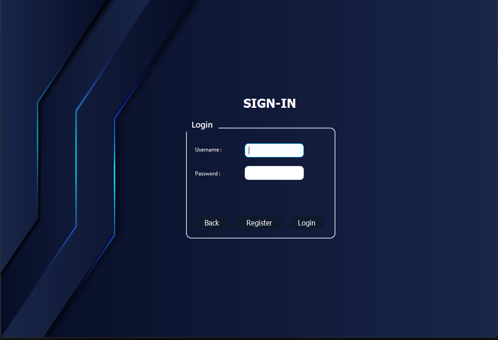
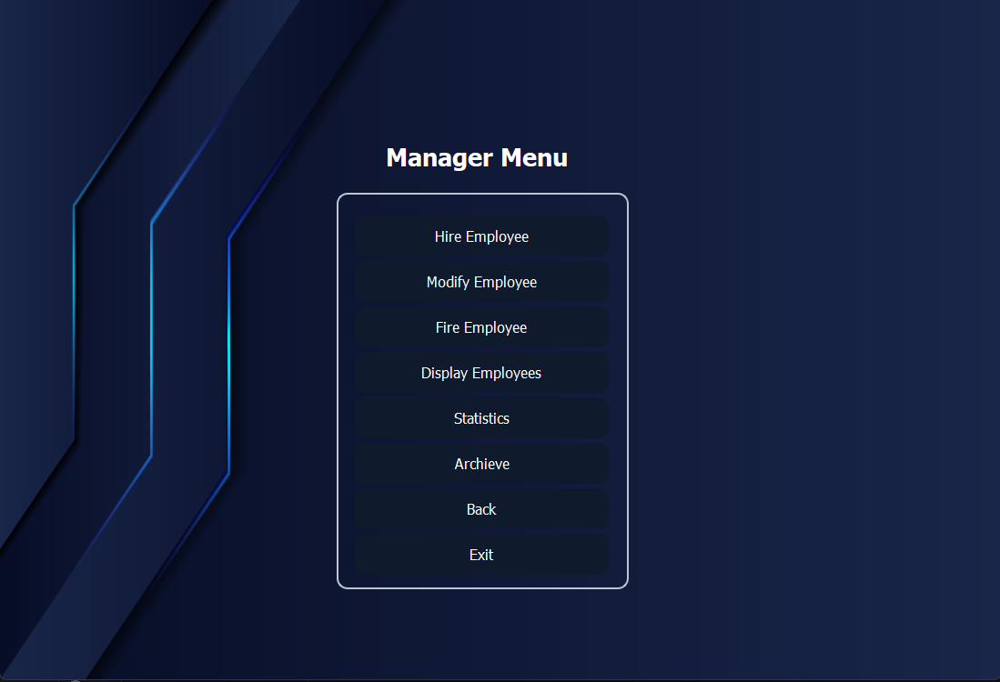
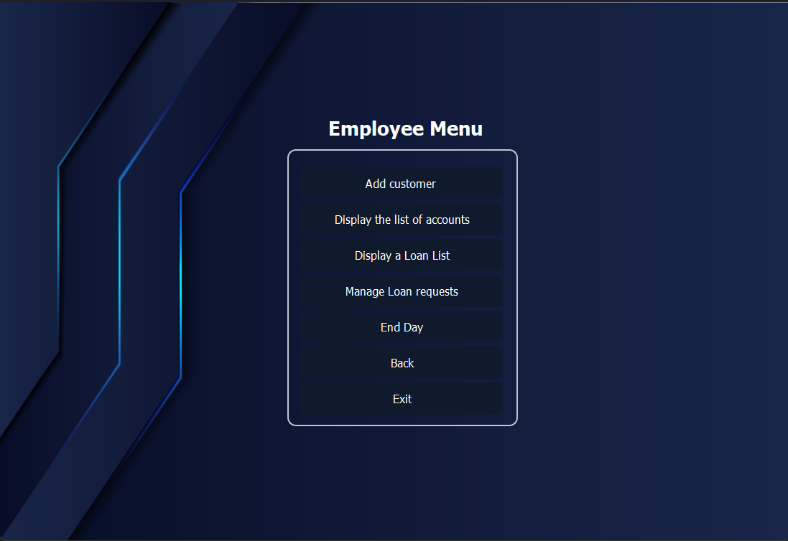
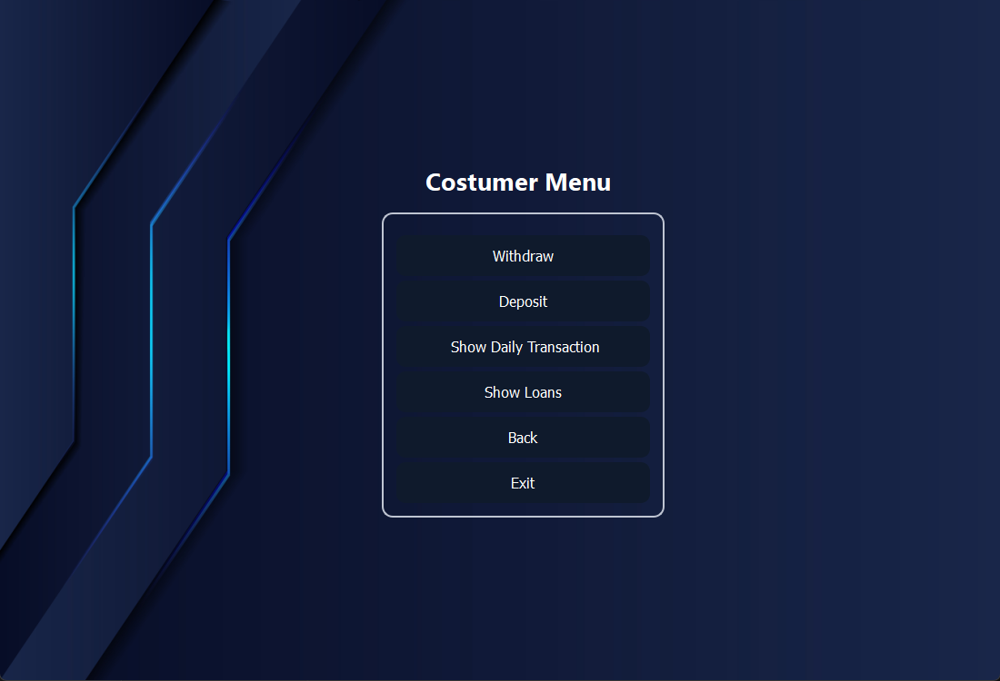
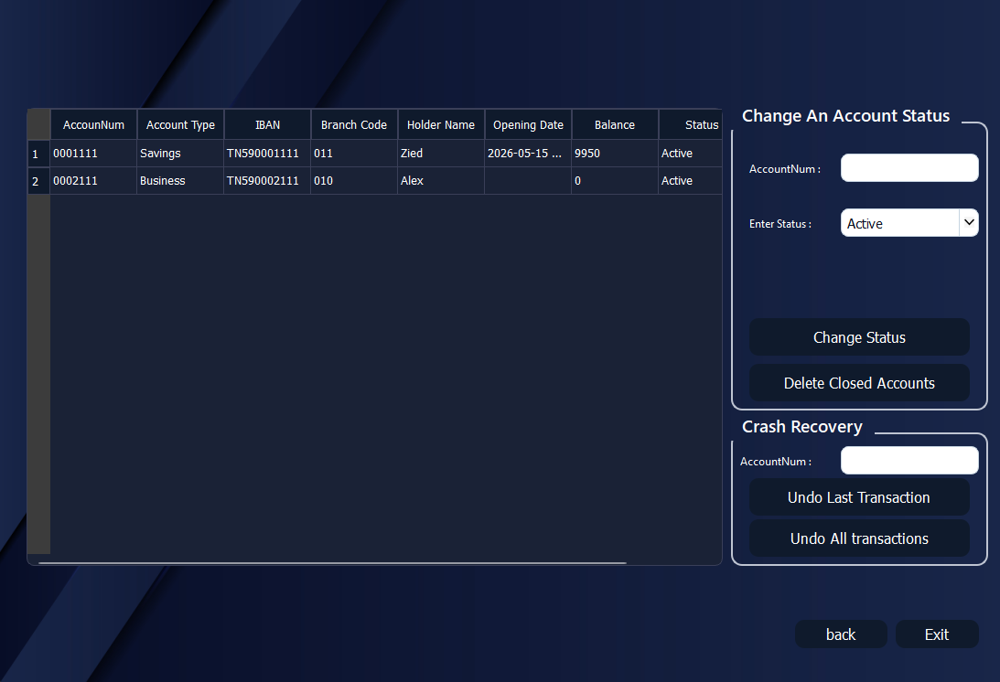
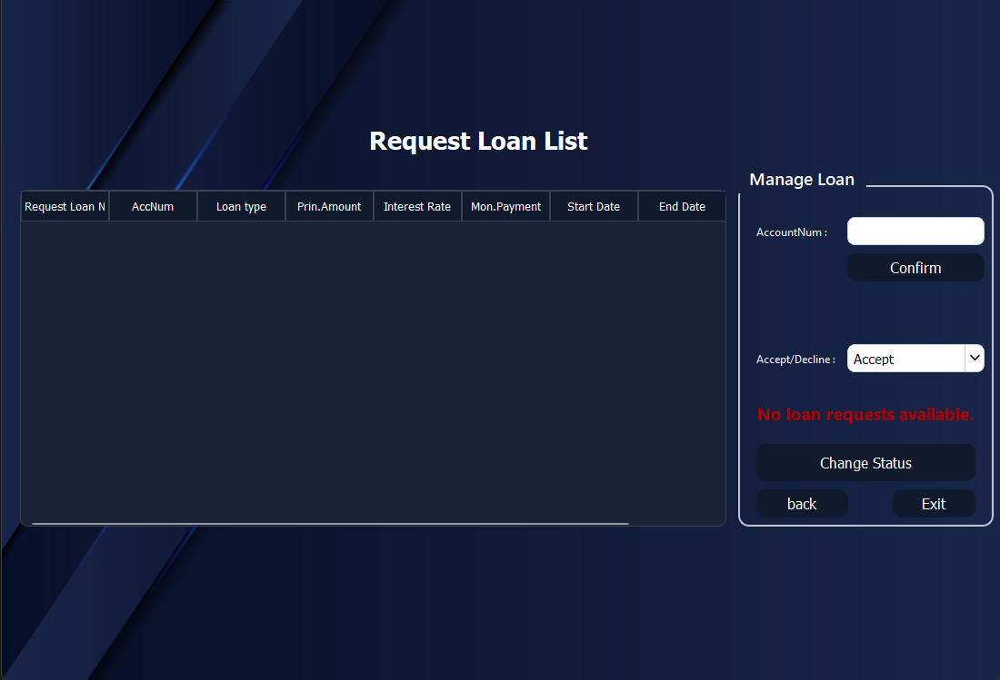
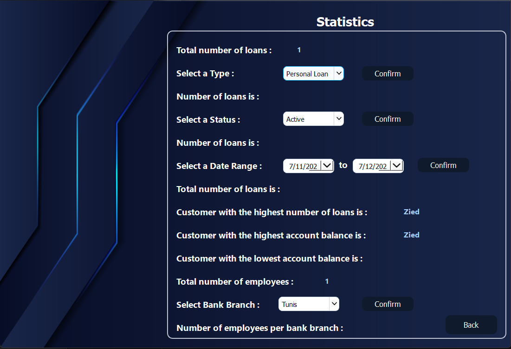

# Banking Management System

A desktop banking management application built with C++ and Qt.
The system allows customer management, transaction handling, loan processing, employee administration, and statistical reporting through a graphical user interface.

---

## Features

* Customer account management
* Deposit and withdrawal operations
* Loan request and approval system
* Employee management
* Daily transaction tracking
* Statistics dashboard
* Account archive system
* Multi-window Qt GUI

---

## Technologies Used

* C++
* Qt Framework
* Qt Widgets
* CMake
* Object-Oriented Programming
* File Handling

---

## Screenshots

### Login Interface



### Manager Menu



### Employee Menu



### Customer Menu




### Customer Management



### Loan Management



### Statistics Dashboard



---

## Project Structure

```bash
Banking-Management-System/
│
├── screenshots/
├── docs/
│
├── *.cpp
├── *.h
├── *.ui
├── *.qrc
├── *.png
│
├── README.md
├── CMakeLists.txt
├── .gitignore
```

---

## How to Run

1. Install Qt Creator and Qt 6
2. Clone the repository

```bash
git clone https://github.com/Zied-abdennour/Banking-Management-System.git
```

3. Open `CMakeLists.txt` using Qt Creator
4. Configure the Qt kit
5. Build and run the project

---

## Documentation

Detailed project documentation is available in:

```bash
docs/project-report.pdf
```

---

## Future Improvements

* Database integration
* Authentication system
* REST API integration
* Better UI/UX design
* Cloud synchronization

---

## Author

Zied Abdennour
First-year Computer Science Engineering Student
